# Cloud Identity & Access Lab - Microsoft Entra ID

A cloud-native identity and access lab in Microsoft Entra ID: automated user provisioning with the Microsoft Graph PowerShell SDK, MFA and Conditional Access enforcement, self-service password reset, and SAML SSO to a SaaS app. No on-prem, no servers.

## Overview

This lab builds and secures a cloud-only identity environment in Microsoft Entra ID. Cloud users are provisioned from a CSV with an idempotent Graph PowerShell script, access is hardened with Conditional Access (MFA and legacy-auth blocking, rolled out report-only first) and self-service password reset, and a SaaS app is wired up for SAML single sign-on with group-based access. It is the cloud counterpart to my [Active Directory homelab](https://github.com/zachou66/active-directory-homelab).

## Phases

| Phase | Focus | Status |
| --- | --- | --- |
| 0 | Tenant prep & safety | Done |
| 1 | Cloud identity foundation | Done |
| 2 | Graph PowerShell provisioning | Done |
| 3 | Authentication hardening (MFA / SSPR / Conditional Access) | Done |
| 4 | SAML SSO to a SaaS app | Done |

## Phase 0 - Tenant Prep & Safety

Confirm licensing and create an emergency break-glass admin before any policy work.

Phase 0 is critical to this project because in case anything goes very wrong with my main account, I still have this account that I created because it's specifically meant as a backup administrator account. It's excluded from the CA on purpose to keep it secure.

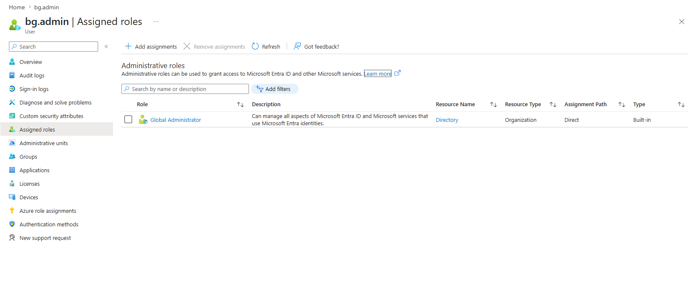

## Phase 1 - Cloud Identity Foundation

Build cloud-only groups and users, including a dynamic group that auto-fills by
department.

The difference between an assigned group and a dynamic group is that a user can be added to an assigned group by manually adding them or automating it through scripting. A dynamic group is a type of group where you are added based on a rule or a set of rules. In this case for an example, the user "Maya Torres" was added into the Marketing dynamic group because her profile matched the rule as she was part of the Marketing department.

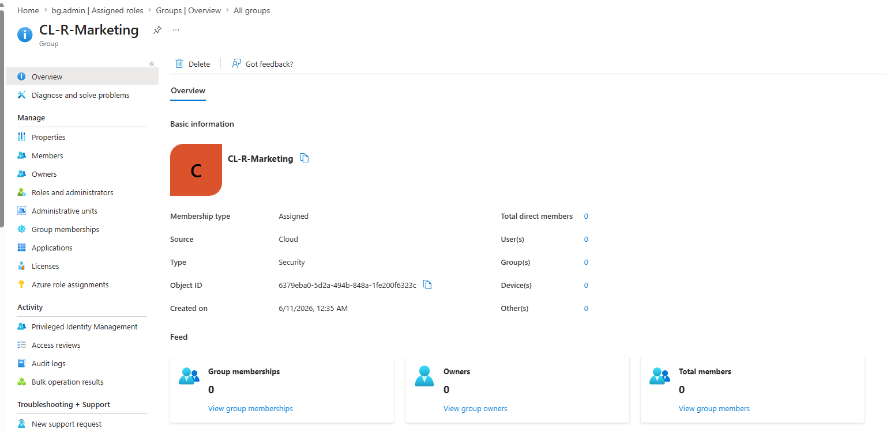
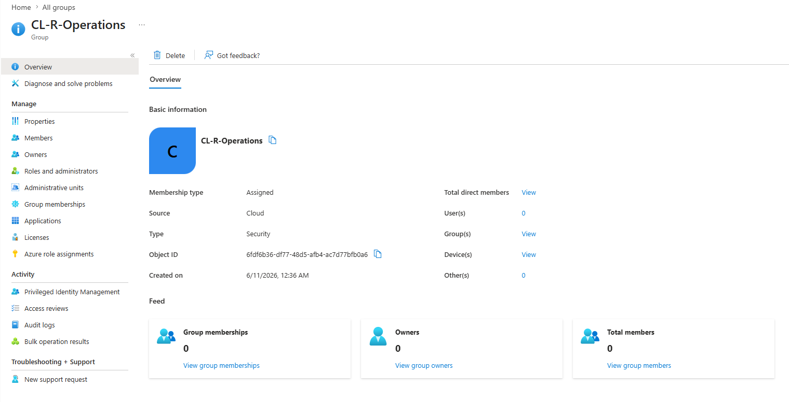
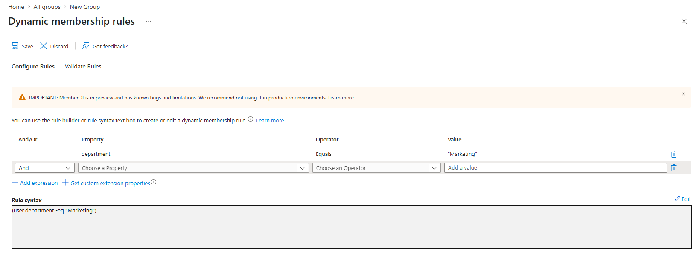
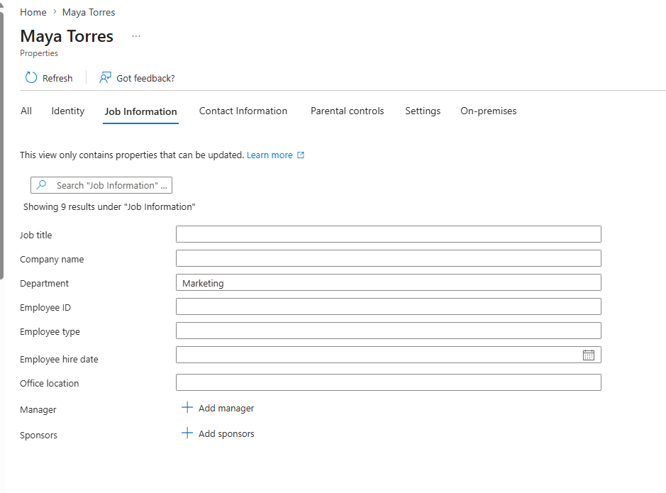
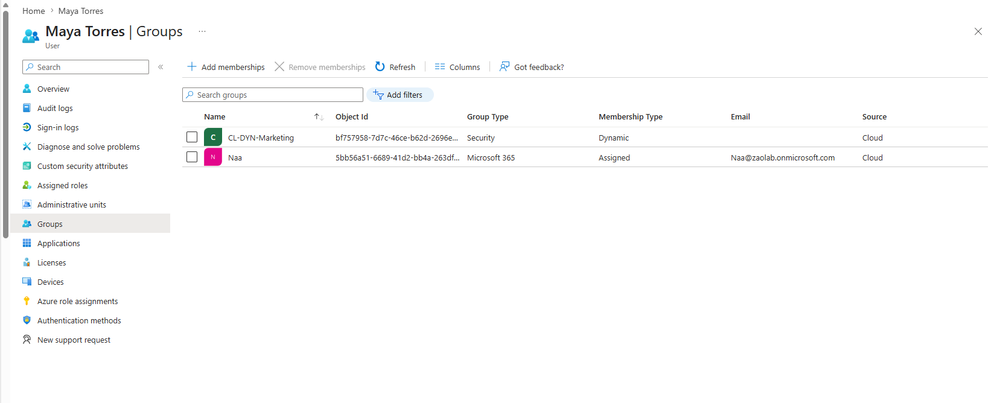

## Phase 2 - Graph PowerShell Provisioning

Automate cloud user onboarding from a CSV, idempotently, with logging.

I first tried to run the script but it failed because the Microsoft Graph SDK modules were missing, so I installed the ones that provide Get-MgUser and New-MgUser.

I learned that idempotent is when some kind of script or operation has the ability to run once, fill in the information, and then run the same script again without duplication.

The proof is two runs of the same CSV: [run 1](Provisioning/sample-logs/run1-created.txt) creates every user, [run 2](Provisioning/sample-logs/run2-skipped.txt) skips every user.

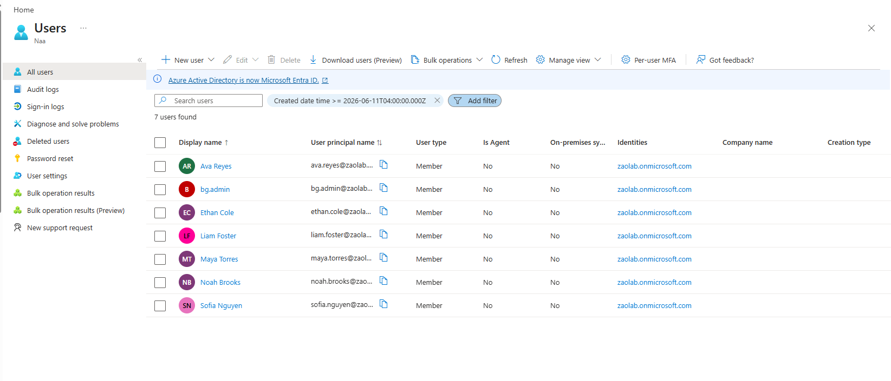

## Phase 3 - Authentication Hardening

Enforce MFA and block legacy auth with Conditional Access; enable self-service password reset.

Report-only first allows you to safely preview policy impacts in the sign in logs before you actually enforce the policy in order to prevent account lockouts. Microsoft's security defaults are basically pre-applied policies that ensure security by default, while conditional access is more of a manual custom security architecture that you are manually configuring, allowing for more complexity in policies.

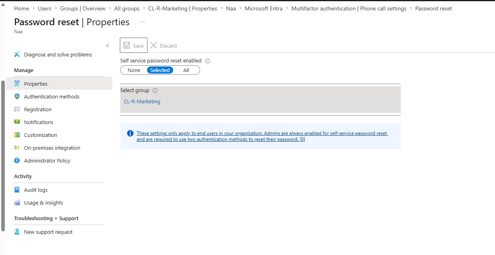
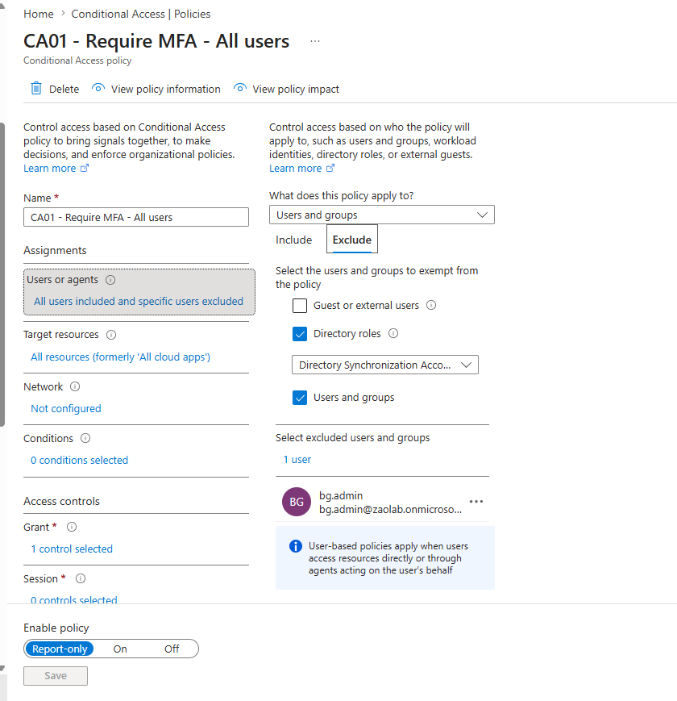
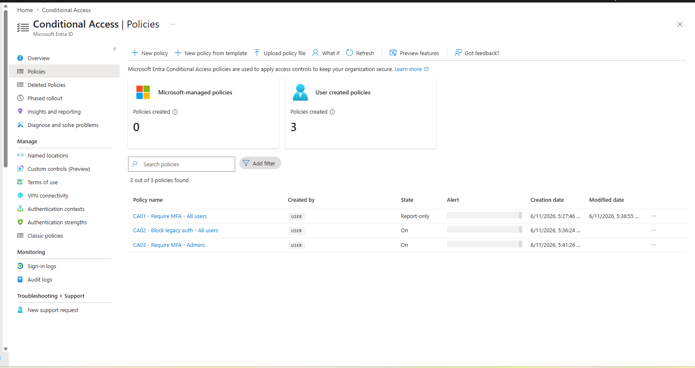
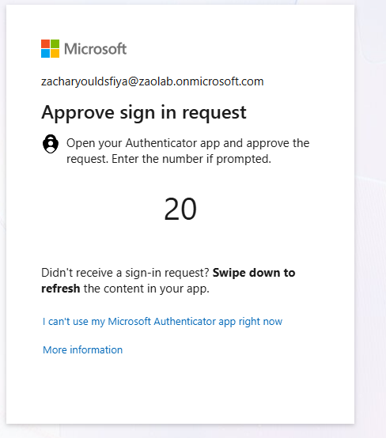
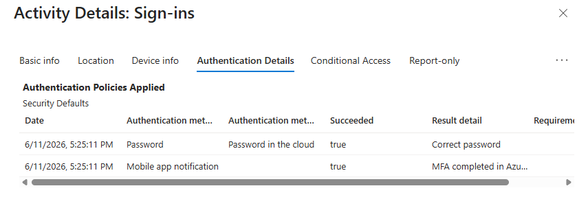
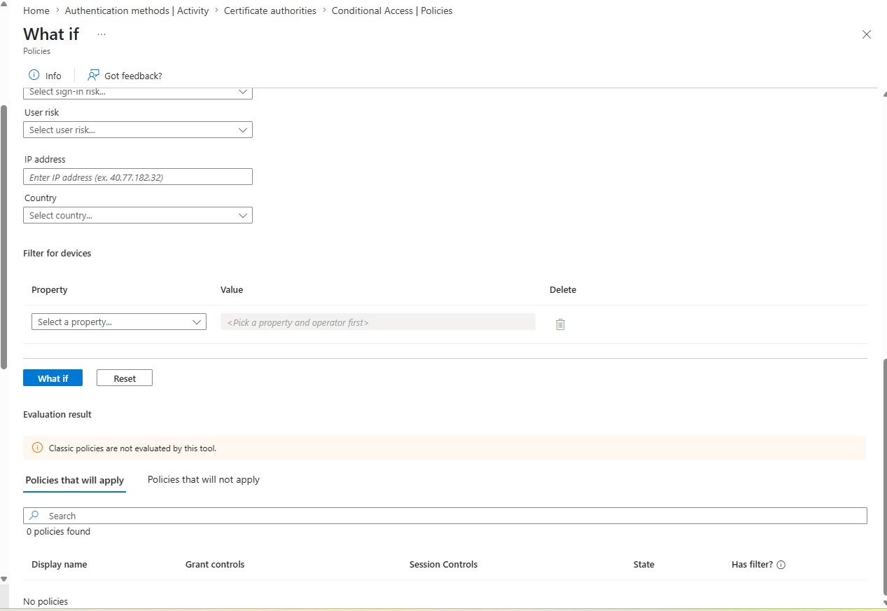

## Phase 4 - SAML SSO to a SaaS App

Stand up SAML single sign-on to a SaaS app with group-based access.

SSO is a protocol that uses SAML in order to provide end users access to login to multiple applications within a single organization, without the need of repeatedly entering credentials every time you want to log in. When a user clicks the login button, because Entra shares the SAML configuration with the application, they are redirected to Entra ID for authentication, and once their identity is verified, they're provided with a signed SAML token to the application which means the application trusts the user. This is what tells the application to trust the signature and seamlessly grant the user their access.

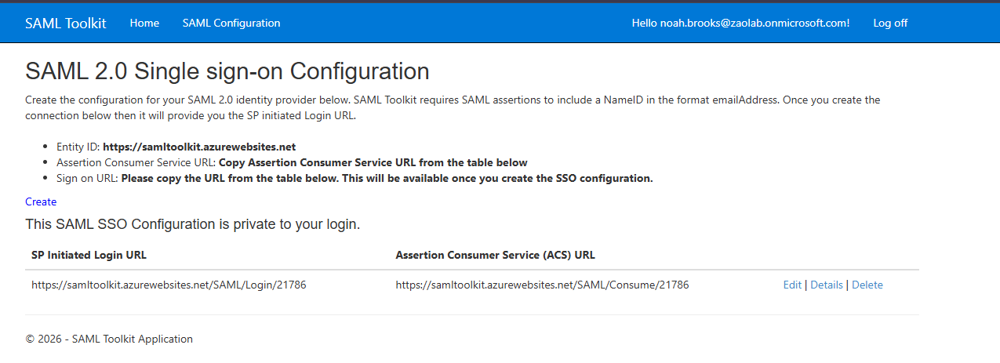
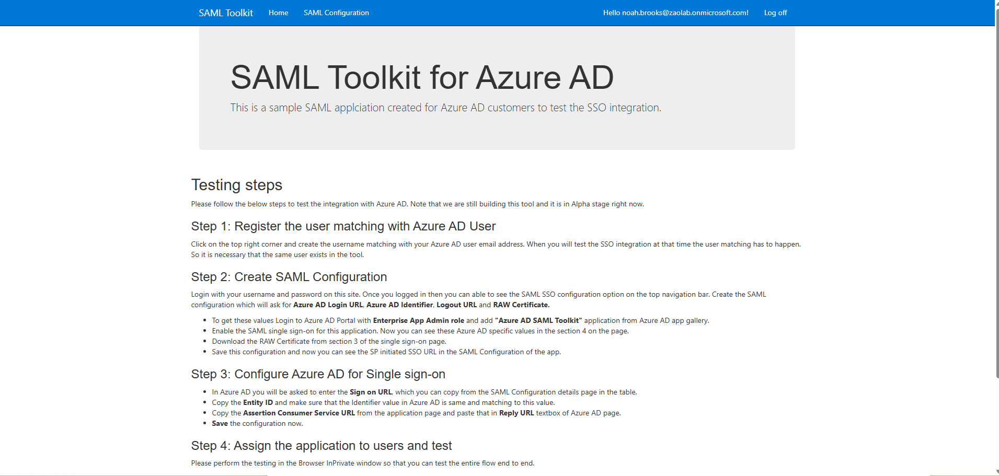
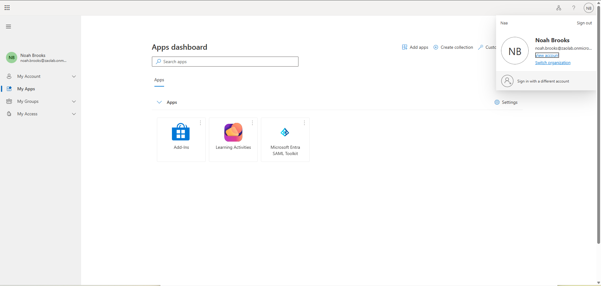
